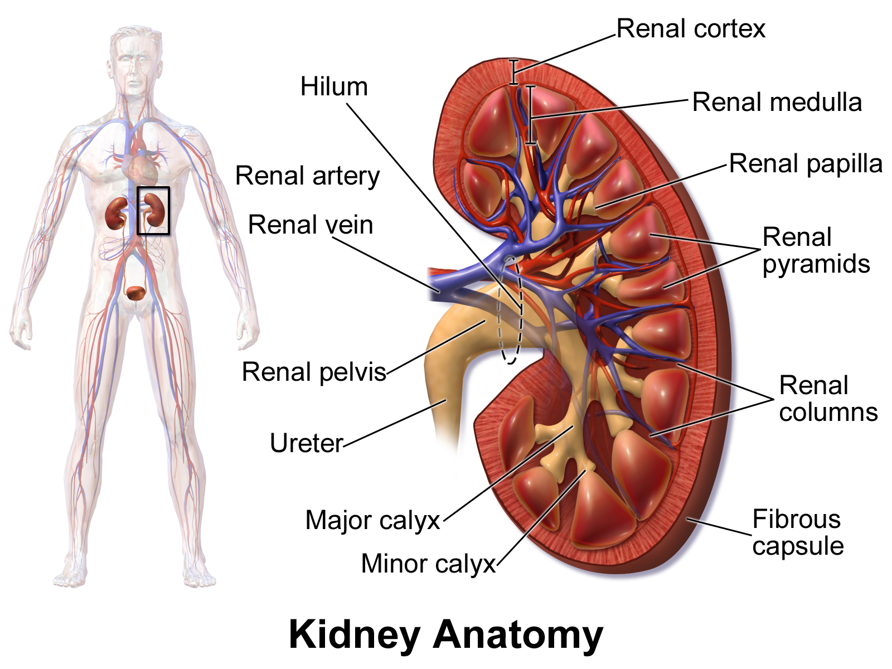
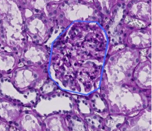

# Kaggle HuBMAP-Hacking-the-Kidney

## Info

- <a href="https://github.com/YusukeTakahashi2001/Kaggle_HuBMAP-Hacking-the-Kidney/projects/1" target="_blank">Project Board</a>
- <a href="https://www.comet.ml/yusuketakahashi2001/kaggle-hubmap-hacking-the-kidney/view/im79MrUJdAmu3N0Eoy8CD97ex" target="_blank">Comet</a>

## Dataset
|Name|Detail|Ref|
|---|---|---|
|train/|trainのtiff画像,maskに関するjsonファイル|None|
|test/|testのtiff画像,jsonファイル|None|
|zip/|resizeされたtrain画像,mask画像|extension:png|
|HuBMAP-20-dataset_information.csv|患者の詳細|None|
|sample_submission.csv|提出例のcsvファイル|None|
|train.csv|患者IDとエンコードが含まれたcsvファイル|None|

## Paper
|No.|Status|Name|Detail|Date|Url|
|---|---|---|---|---|---|
|Dummy|Dummy|Dummy|Dummy|Dummy|Dummy|

## Features
|Name|Shape|size(MB)|Detail|
|---|---|---|---|
|Dummy|Dummy|Dummy||

## Memo
- 提出ファイルは submision.csv じゃないとだめ！
- 提出締め切りは~~February 1,2021！~~(11:59 PM UTC => 日本時間 8:59 AM February 2,2021)
- 評価指標は<a href ="https://en.wikipedia.org/wiki/S%C3%B8rensen%E2%80%93Dice_coefficient">Dice Coefficient</a>(日本語和訳なし)
## About Competition

###  Competition Description 

ある推論では,地球には70億人を超える人々がいて、天の川銀河には3000億を超える星々が存在しているらしい。これと比較すると、人間の大人の体内には37兆もの細胞がある。これらの細胞の間の働きと関係を決定することは、途方もないことです。もし私達が細胞の働きについてより理解すれば、人間の健康の多くの範囲が影響されるでしょう。この大量のデータについての問題は、Kaggleのコミュニティに最適なのです。
    
人のゲノム研究が人のDNAの全体をマッピングしたのと同様に、人間の生体分子アトラスプログラム(HubMAP)は、主要な取り組みです。国立衛生研究(NIH)がスポンサーのHuBMAPは歴史上初めて糸球体機能組織単位のレベルで人体をマッピングするためのフレームワークの開発を促進するために取り組んでいます。HuBMAPは世界最大の共同生物学研究の1つになることを望んでおり、細胞レベルでの人体のオープンマップになることを目指しています。

このコンペ、「Hacking the Kidney」では、単一細胞である人間の腎臓についてのマッピングをすることから始めます。

あなた達の課題は、様々な組織準備パイプラインを通じて、機能組織ユニットたち(FTUs)を検出することです。FTUとは、「毛細血管を中心とする3次元の細胞のブロックであり、このブロック内にある細胞は、ブロック内の他の細胞から拡散距離内にあるようなもの」(de Bono, 2013)と定義されます。このコンペのゴールは、成功し、堅牢なFTU検出器の実装です。

また、追加の検討のために、調査結果を審査員団に提示する機会もあります。 提出が成功すると、細胞間の関係が個人の健康にどのように影響するかを判断するために必要なツール、リソース、および細胞アトラスが構築されます。

HuBMAPの進歩によって細胞と組織の組織、機能と人間の健康の間の関係について世界の理解が加速します。これらのデータセットと見通しは細胞や組織解剖学の研究者、製薬会社による治療法の発展、あるいは親が子供に人体の大きさを示すために使うことが出来ます。

###  Data Description 

このコンペで使われるHuBMAPデータは11の新鮮な冷凍、及び９枚のホルマリン埋め込みパラフィン(FFPE)の
PAS腎臓画像が含まれています。糸球体FTUアノテーションは20の組織サンプル全てに存在します。これらのいくつかはトレーニング用に共有され、その他は提出された際の審査に使用されます。

60万を超える糸球体が腎臓に存在し、<a href="https://onlinelibrary.wiley.com/doi/abs/10.1002/ar.1092320205"> (Nyengaard, 1992)</a>一般的に正常な腎臓は直径100から350μmのほぼ球の形をしています<a href ="https://creativecommons.org/licenses/by/4.0/">Attribution 4.0 International (CC BY 4.0)</a>。

チームは、PAS染色顕微鏡データで糸球体を識別するセグメンテーションアルゴリズムを開発する研究に招待されます。 FTUセグメンテーションをサポートするために、他の外部データや事前トレーニング済みの機械学習モデルを使用することは大丈夫です。 使用されるすべてのデータとすべてのコードは、<a href="https://creativecommons.org/licenses/by/4.0/">Attribution 4.0 International（CC BY 4.0）</a>でリリースする必要があります。

#### The Dataset

データセットは500 MBから5 GBの巨大なTIFFファイルから構成されており、8つはトレーニング用、5つは公開テスト用のものです。トレーニング用のデータセットはRLEにエンコードされたものと、エンコードされていないJSON形式の両方の注釈があります
.

トレーニング用,公開テストデータセットもまた,解剖学的分裂構造のものも含んでおります.

#### File Structure 
JSONファイルは次のように構成されており,各機能には次のようなものがあります.
- 'Type'(機能)とオブジェクトタイプの'ID'(PathAnnotationObject).全てのファイルで同じであり,信号を送らないことに注意してください.
- 'Geometry'には機能の囲みボリュームのための座標ありのポリゴンが含まれています.
- 追加の'properties'には,画像の中に機能の名前と色が含まれています.
- 'IsLocked' のものはファイルタイプ間で同じであり,信号を送りません.

オブジェクトには固有のIDを持ってない.画像についての予測はすべての画像はRLEにエンコードされたマスク.マスクは,エンコード時にバイナリじゃないとだめ.0はマスクされたピクセルがないことを示し,1はマスクされたピクセルがあることを示します.

 train.csv には,それぞれの画像に対しての固有のIDを持っており,同様に画像内のオブジェクトのマスクのRLEエンコード表現が含まれています.詳しくは evaluation を参考.
 HuBMAP-20-dataset_information.csv には追加の情報(匿名化された患者データを含む)が入っています.

#### Column info

Detail about HuBMAP-20-dataset_information

|Name|Explanation|
|---|---|
|image_file|画像のファイル名。拡張子は.tiff|
|width_pixels|画像のwidth|
|height_pixels|画像のheight|
|glomerulus_segmentation_file|糸球体の画像領域(ファイル名)。拡張子は.json|
|patient_number|患者の番号(固有)|
|race|人種。Black or Africa:黒人もしくはアフリカ人,White:白人|
|ethnicity|民族性？ヒスパニックやらラテン系やら.このコンペとの関連性は現在未知.|
|sex|性別|
|age|年齢|
|weight_kilograms|体重(kg)|
|height_centimeters|身長(cm)|
|bmi_kg/m^2|BMI値|
|laterality|(ラテラリティ)腎臓が左右どちらか。Right or Left。左右で高さが違うらしい.|
|percent_cortex|腎皮質の割合(50~80%)。髄質と腎被膜に挟まれており、内部に糸球体を持つ.|
|percent_medulla|腎臓の髄質の割合(20%-50%)。外層と内装に別れており、腎錐体などから構成される。詳しくは<a href="./data/info/pdf/001_Medulla.pdf">001_Medulla</a>|

## Log

### 20201223
- Join
- 基本的なフォルダ構成完了
- comet_mlのAPIとかdata_ignoreフォルダ内に配置したい。(完了)
- Column infoの作成
    percent_certexの意味を調べてくれ明日の俺。
    medullaもよろしく。<==当日調べた(偉い!)
- 腎臓の部位？説明画像見つけた！

    
    

- 糸球体って何？
    >"腎臓の構造と働き"
    >"腎臓の重要な働きのひとつに、血液中の老廃物や塩分をろ過し、尿として体の外に排出することがあります。この働きをしているのが糸球体です。細い毛細血管が毛糸の球のように丸まってできているので「糸球体」と呼ばれます。この糸球体は大体0.1ミリ～0.2ミリほどの大きさですが、１つの腎臓に約100万個の糸球体があります。この糸球体はふるいのような構造をしており、心臓から腎臓に流れ込んできた血液が、この糸球体を通ると、老廃物がふるいを通って濾過されます。そして赤血球やたんぱくなどは濾過されず、きれいになった血液が、腎臓から出ていきます。"
    >>https://jsn.or.jp/general/kidneydisease/symptoms01.php#p-001
- ヒスパニックって何?
    >"ヒスパニック"
    >"ヒスパニックとは、アメリカ合衆国における、スペイン語を日常語とするラテンアメリカ系の住民の総称。主にメキシコからの移民が多い。白人や黒人などは肌の色で判断するが、ヒスパニックの場合は肌の色で判断しない。ヒスパニックの特徴としては、カトリック信者が多い点や、人口増加率が高く若年労働力が豊富な点、スペイン語のみの地域社会を形成し、独自の文化や価値観を維持する傾向にある点などが挙げられる。"
    >>https://www.weblio.jp/content/%E3%83%92%E3%82%B9%E3%83%91%E3%83%8B%E3%83%83%E3%82%AF

### 20201224

- 前回に引き続き,ドメイン知識を深める.
    要約

    - HuBMAPは人体の組織を顕微鏡で撮った画像から医学的に組織機能ユニット(FTUs)の関係を調べるところ.
    - 膵臓内のFTUsとは? => Glomeruli(糸球体)だよー.糸球体については[Log-20201223](#20201223)を参照
    - PC がぶっ壊れたので作業できず...

### 20201228

- 4日もできてない！まずい...
- 画像の黒いつぶつぶが糸球体.

    
- 糸球体マスクは手作業のものとDeepLearningのが混ざってる.JSONファイルに糸球体の座標リストが入ってる

### 20201229

- とりあえず他の方のを参考に動かしてみる.ドメイン知識はとりあえず終了.
- 年末忙しくて作業できてない.

### 20201230

- フォーマット済み文字数リテラル(f文字列)について.
    => print()の中に文字列と変数を一緒にするとき楽!
    ex.1)f文字列を使用しない場合.　　

    `print("Number is :{}".format(num_a))`

    
    ex.2)f文字列を使用する場合.　　

    ` print(f"Number is : {num_a}") `

### 20201231

- utility_funcの内容の理解.
    #### rle2mask: rleにエンコードされたものをデコードする
    - returnされるのはリサイズされた画像
    - 引数
    1. maskのRLEされたもの
    2. デコード後の画像shape

    #### mask2rle:rle2maskの逆
    - returnされるのは分からんエンコードされた文字列?
    `' '.join(str(x) for x in runs) `
    - 引数
    1. img

    #### read_image
    Overview
    1. Tiff画像の読み込み
    2. デコードされたマスクの用意(rle2maskの利用)
        shapeをTiff画像と同じにする.
    3. マスク,tiff画像のshapeを表示
    4. もし引数でscaleが指定されていればリサイズ.
        resize後のshapeを表示
    5. returnされるのは
        1. resizeされたtiff画像
        2. resizeされたmask

    #### read_test_image
    read_imageのmaskがないバージョン

    #### plot_image_and_mask
    tiff画像とマスクを別々に表示
    1. 画像のみを表示
    2. 画像とマスクを重ねて表示
    3. マスクのみを表示

    #### plot_grid_image_with_mask
    `plot_image_and_mask(image, mask, image_id):`
    グリッド表示で画像とマスクを表示

    #### plot_slice_image_and_mask
    拡大した画像の表示
    `plot_slice_image_and_mask(image, mask, start_h, end_h, start_w, end_w)`

### 20210105
すっごく挫折しそう...
まずセグメンテーションに関する知識が少なくてコード見てもわからん
続いて成人式延期のハガキ...　がん萎えプツプツ怒りフィーバー

- UneXt50,ASPPって何ぞ?
- Feature Pyramid Network [FPN](https://qiita.com/TaigaHasegawa/items/653abc81ac4ee1f0d7b8)
     様々なスケールの物体を認識し,検出することが目的. 
    わからなかった用語
    - ボトムアップ
    - トップダウン

- 今回参考にした人のモデル

