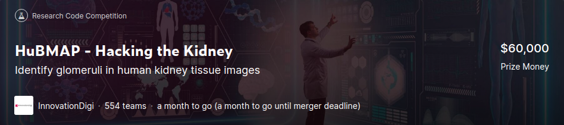

# Kaggle HuBMAP-Hacking-the-Kidney

## Dataset
|Name|Detail|Ref|
|---|---|---|
|dummy |Dummy|Dummy|

## Paper
|No.|Status|Name|Detail|Date|Url|
|---|---|---|---|---|---|
|Dummy|Dummy|Dummy|Dummy|Dummy|Dummy|

## About Competition

###  Competition Description 

ある推論では,地球には70億人を超える人々がいて、天の川銀河には3000億を超える星々が存在しているらしい。これと比較すると、人間の大人の体内には37兆もの細胞がある。これらの細胞の間の働きと関係を決定することは、途方もないことです。もし私達が細胞の働きについてより理解すれば、人間の健康の多くの範囲が影響されるでしょう。この大量のデータについての問題は、Kaggleのコミュニティに最適なのです。
    
人のゲノム研究が人のDNAの全体をマッピングしたのと同様に、人間の生体分子アトラスプログラム(HubMAP)は、主要な取り組みです。国立衛生研究(NIH)がスポンサーのHuBMAPは歴史上初めて糸球体機能組織単位のレベルで人体をマッピングするためのフレームワークの開発を促進するために取り組んでいます。HuBMAPは世界最大の共同生物学研究の1つになることを望んでおり、細胞レベルでの人体のオープンマップになることを目指しています。

このコンペ、「Hacking the Kidney」では、単一細胞である人間の腎臓についてのマッピングをすることから始めます。

あなた達の課題は、様々な組織準備パイプラインを通じて、機能組織ユニットたち(FTUs)を検出することです。FTUとは、「毛細血管を中心とする3次元の細胞のブロックであり、このブロック内にある細胞は、ブロック内の他の細胞から拡散距離内にあるようなもの」(de Bono, 2013)と定義されます。このコンペのゴールは、成功し、堅牢なFTU検出器の実装です。

また、追加の検討のために、調査結果を審査員団に提示する機会もあります。 提出が成功すると、細胞間の関係が個人の健康にどのように影響するかを判断するために必要なツール、リソース、および細胞アトラスが構築されます。

HuBMAPの進歩によって細胞と組織の組織、機能と人間の健康の間の関係について世界の理解が加速します。これらのデータセットと見通しは細胞や組織解剖学の研究者、製薬会社による治療法の発展、あるいは親が子供に人体の大きさを示すために使うことが出来ます。

###  Data Description 

このハッカソンで使われるHuBMAPデータは11の新鮮な冷凍、及び９枚のホルマリン埋め込みパラフィン(FFPE)no
PAS腎臓画像が含まれています。糸球体FTUアノテーションは20の組織サンプル全てに存在します。これらのいくつかはトレーニング用に共有され、その他は提出された際の審査に使用されます。

60万を超える糸球体が腎臓に存在し、<a href="https://onlinelibrary.wiley.com/doi/abs/10.1002/ar.1092320205"> (Nyengaard, 1992)</a>一般的に正常な腎臓は直径100から350μmのほぼ球の形をしています<a href ="https://creativecommons.org/licenses/by/4.0/">Attribution 4.0 International (CC BY 4.0)</a>。

チームは、PAS染色顕微鏡データで糸球体を識別するセグメンテーションアルゴリズムを開発する研究に招待されます。 FTUセグメンテーションをサポートするために、他の外部データや事前トレーニング済みの機械学習モデルを使用することは大丈夫です。 使用されるすべてのデータとすべてのコードは、<a href="https://creativecommons.org/licenses/by/4.0/">Attribution 4.0 International（CC BY 4.0）</a>でリリースする必要があります。

#### The Dataset

データセットは500 MBから5 GBの巨大なTIFFファイルから構成されており、8つはトレーニング用、5つは公開テスト用のものです。トレーニング用のデータセットはRLEにエンコードされたものと、エンコードされていないJSON形式の両方の注釈があります
